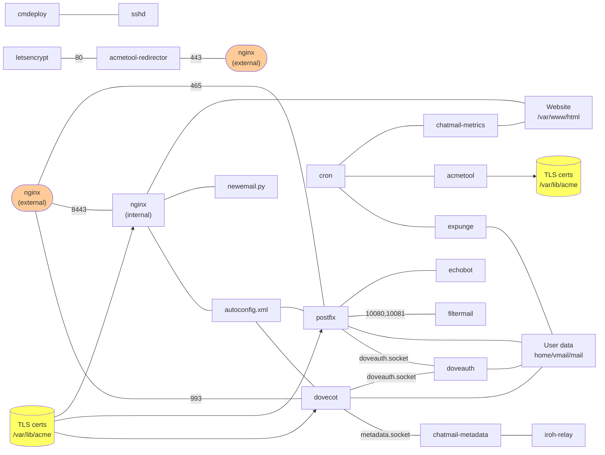

This diagram shows components of the chatmail server; this is a draft
overview as of mid-August 2025:

The edges in this graph should not be taken too literally; they
reflect some sort of communication path or dependency relationship
between components of the chatmail server.
