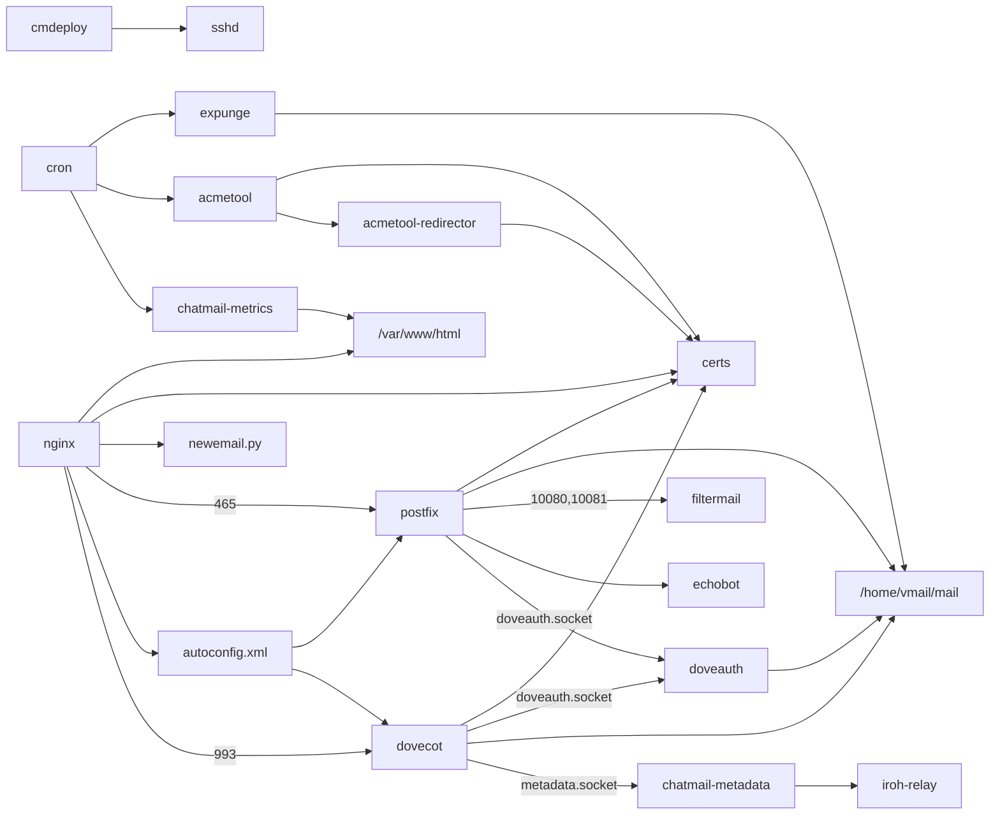

This diagram shows components of the chatmail server:

(Arrows in this diagram do not have a specific formal meaning; they
signify "depends on", or "uses", or "sends data to", or just "relates
to".)
